# Classification results for author classification
This page contains the classification results for the various algorithms, letter author classification

## Classifier: Perceptron with word bi-grams
- Algorithm: Scikit-learn perceptron
- Features: word bigrams in addition to single words
- Reported by: Stefan Langer

### Performance

- Seconds used for training: 180
- Seconds used for classification: 17

### Classification report
                                  precision    recall  f1-score   support

                     Franz Kafka       0.95      0.92      0.93       280
              Friedrich Schiller       0.80      0.77      0.79       266
                    Henrik Ibsen       0.97      0.99      0.98       897
                     James Joyce       0.97      0.92      0.95       682
      Johann Wolfgang von Goethe       0.70      0.80      0.75       228
                  Virginia Woolf       0.97      0.99      0.98      1901
                   Wilhelm Busch       0.99      0.93      0.96       627

                        accuracy                           0.95      4881
                       macro avg       0.91      0.90      0.90      4881
                    weighted avg       0.95      0.95      0.95      4881

### Confusion matrix
      [[ 258    3    7    0    7    0    5]
       [   1  205    7    0   52    0    1]
       [   1    1  892    1    1    0    1]
       [   0    0    0  629    0   53    0]
       [   3   39    3    0  182    0    1]
       [   0    0    1   19    0 1881    0]
       [   9    7   12    0   17    0  582]]
			 
### Confusion Matrix (img)

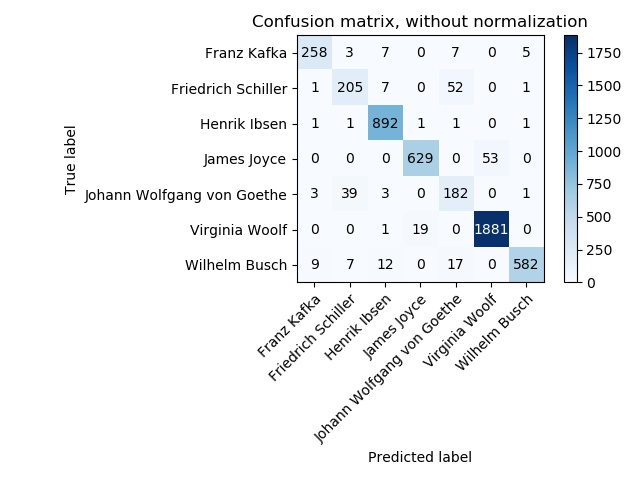

## Classifier: Perceptron with single words
- Algorithm: Scikit-learn perceptron
- Features: single words
- Reported by: Stefan Langer

### Performance: 

- Seconds used for training: 66
- Seconds used for classification: 18

### Classification report

                                precision    recall  f1-score   support

                   Franz Kafka       0.98      0.82      0.89       280
            Friedrich Schiller       0.66      0.91      0.76       266
                  Henrik Ibsen       0.99      0.99      0.99       897
                   James Joyce       0.93      0.93      0.93       682
    Johann Wolfgang von Goethe       0.78      0.64      0.71       228
                Virginia Woolf       0.98      0.98      0.98      1901
                 Wilhelm Busch       0.95      0.94      0.95       627

                      accuracy                           0.94      4881
                     macro avg       0.90      0.89      0.89      4881
                  weighted avg       0.95      0.94      0.94      4881

 
### Confusion matrix: 

	[[ 230   21    1    0    8    0   20]
	 [   0  241    0    0   22    0    3]
	 [   0    6  886    2    2    0    1]
	 [   0    0    1  637    0   44    0]
	 [   0   78    0    0  146    0    4]
	 [   0    0    1   44    0 1856    0]
	 [   4   21    2    0    8    0  592]]
	 
### Confusion Matrix (img)

## Classifier: Logistic Regression with word bi-grams
- Algorithm: Scikit-learn logistic regression
- Features: word bigrams in addition to single words
- Reported by: Shuzhou Yuan, Shanshan Bai

### Performance

- Seconds used for training: 80
- Seconds used for classification: 0.05
        
	
### Classification report
                            precision    recall  f1-score   support

               Franz Kafka       0.90      0.88      0.89      1017
        Friedrich Schiller       0.81      0.81      0.81       978
              Henrik Ibsen       1.00      0.98      0.99      3209
               James Joyce       0.96      0.88      0.92      2459
    Johann Wolfgang von Goethe   0.77      0.76      0.76       817
            Virginia Woolf       0.96      0.99      0.97      6872
             Wilhelm Busch       0.93      0.96      0.95      2232

                 micro avg       0.94      0.94      0.94     17584
                 macro avg       0.90      0.89      0.90     17584
              weighted avg       0.94      0.94      0.94     17584

### Confusion matrix
	[[ 900   18    0    0   28    0   71]
 	[  24  797    0    0  125    0   32]
 	[  10   10 3150    6   10    4   19]
 	[   3    0    4 2161    0  289    2]
 	[  24  140    0    0  618    1   34]
 	[   0    0    0   94    0 6778    0]
 	[  39   19    1    0   26    0 2147]]
			  
### Confusion Matrix (img)

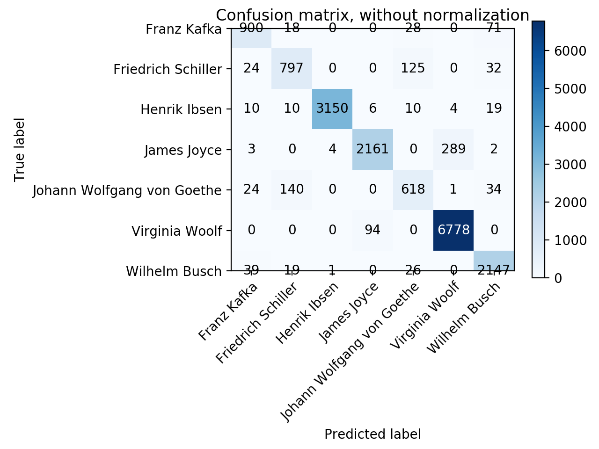

## Classifier: Logistic Regression with single words
- Algorithm: Scikit-learn logistic regression
- Features: single words
- Reported by: Shuzhou Yuan, Shanshan Bai

### Performance: 

- Seconds used for training: 11
- Seconds used for classification: 0.01

### Classification report
                            precision    recall  f1-score   support

               Franz Kafka       0.92      0.86      0.89      1051
        Friedrich Schiller       0.80      0.81      0.80       978
              Henrik Ibsen       1.00      0.99      0.99      3188
               James Joyce       0.95      0.90      0.92      2500
    Johann Wolfgang von Goethe   0.76      0.76      0.76       803
            Virginia Woolf       0.97      0.98      0.97      6871
             Wilhelm Busch       0.93      0.96      0.95      2193

                 micro avg       0.94      0.94      0.94     17584
                 macro avg       0.90      0.89      0.90     17584
              weighted avg       0.94      0.94      0.94     17584

 
### Confusion matrix: 

	[[ 907   25    3    0   25    0   91]
 	[  20  790    0    0  143    0   25]
 	[   8   11 3143    5    4    3   14]
 	[   2    0    4 2253    2  238    1]
 	[  11  147    1    0  610    1   33]
 	[   0    0    0  125    0 6745    1]
 	[  43   19    1    0   16    0 2114]]
	 
### Confusion Matrix (img)

# Classification results for author classification
This page contains the classification results for the various algorithms, letter author classification

## Classifier: k-nearest neighbors with single words
- Algorithm: Scikit-learn k-nearest neighbors
- Parameters: default
- Features: TF-IDF of single words
- Reported by: Xiyue Cui, Zheng Hua

### Performance: 

- Seconds used for training: 126
- Seconds used for classification: 3902

### Classification report

                                precision    recall  f1-score   support

                   Franz Kafka       0.51      0.88      0.65       280
            Friedrich Schiller       0.60      0.57      0.58       266
                  Henrik Ibsen       0.95      0.98      0.97       897
                   James Joyce       0.81      0.80      0.81       682
    Johann Wolfgang von Goethe       0.62      0.47      0.54       228
                Virginia Woolf       0.94      0.94      0.94      1901
                 Wilhelm Busch       0.94      0.72      0.82       627

                      accuracy                           0.85      4881
                     macro avg       0.77      0.77      0.76      4881
                  weighted avg       0.87      0.85      0.85      4881

 
### Confusion matrix: 

	[[ 245   11    7    0    4    0   13]
	 [  62  151    3    0   43    0    7]
	 [   4    4  882    5    2    0    0]
	 [   0    0   13  549    0  120    0]
	 [  55   56    2    0  108    0    7]
	 [   0    0    2  119    0 1780    0]
	 [ 111   29   17    1   17    0  542]]
	 
### Confusion Matrix (img)

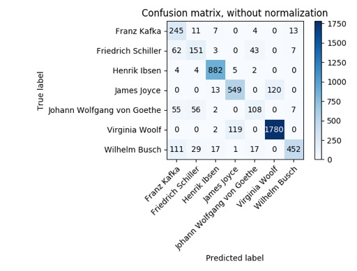

## Classifier: K-nearest neighbors with single words
- Algorithm: Scikit-learn k-nearest neighbors
- Parameters: distance as weights, k=11
- Features: TF-IDF of single words
- Reported by: Zheng Hua, Xiyue Cui

### Performance

- Seconds used for training: 116
- Seconds used for classification: 3904

### Classification report
                                  precision    recall  f1-score   support

                     Franz Kafka       0.51      0.92      0.66       280
              Friedrich Schiller       0.65      0.70      0.67       266
                    Henrik Ibsen       1.00      0.98      0.99       897
                     James Joyce       0.92      0.80      0.86       682
      Johann Wolfgang von Goethe       0.62      0.56      0.59       228
                  Virginia Woolf       0.93      0.98      0.96      1901
                   Wilhelm Busch       0.98      0.64      0.78       627

                        accuracy                           0.87      4881
                       macro avg       0.80      0.80      0.79      4881
                    weighted avg       0.89      0.87      0.88      4881

### Confusion matrix
      [[ 258    6    1    0   10    0    5]
       [  42  187    0    0   36    0    1]
       [   5    3  878    5    6    0    0]
       [   0    0    0  549    0  133    0]
       [  39   59    0    0  128    0    2]
       [   0    0    0   42    0 1859    0]
       [ 160   34    2    0   28    0  403]]
			 
### Confusion Matrix (img)

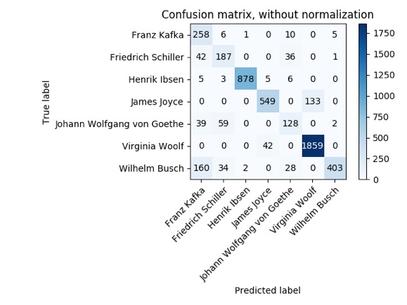

## Classifier: k-nearest neighbors with single words
- Algorithm: Scikit-learn k-nearest neighbors
- Parameters: p = Mahattan Distance
- Features: TF-IDF of single words
- Reported by: Xiyue Cui, Zheng Hua

### Performance: 

- Seconds used for training: 124
- Seconds used for classification: 3911

### Classification report

                                precision    recall  f1-score   support

                   Franz Kafka       0.73      0.04      0.07       280
            Friedrich Schiller       0.74      0.11      0.19       266
                  Henrik Ibsen       0.21      1.00      0.34       897
                   James Joyce       0.97      0.09      0.16       682
    Johann Wolfgang von Goethe       0.83      0.08      0.15       228
                Virginia Woolf       0.94      0.16      0.27      1901
                 Wilhelm Busch       1.00      0.11      0.21       627

                      accuracy                           0.29      4881
                     macro avg       0.77      0.23      0.20      4881
                  weighted avg       0.79      0.29      0.24      4881

 
### Confusion matrix: 

	[[  11    0  269    0    0    0    0]
	 [   1   29  233    0    3    0    0]
	 [   4    0  895    2    0    0    0]
	 [   0    0  603   60    0   19    0]
	 [   1    9  199    0   19    0    0]
	 [   0    0 1595    0    0  306    0]
	 [   2    1  551    0    1    0   72]]
	 
### Confusion Matrix (img)

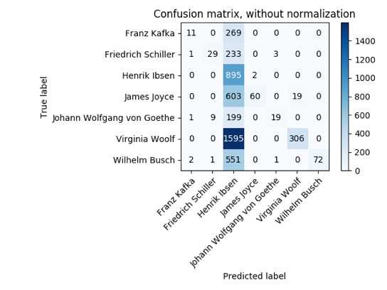

## Classifier: Multi Layered Perceptron
- Algorithm: Scikit-learn MLP
- Features: tf.idf Wort-Unigramme
- Reported by: Jing Hu

### Performance
- Seconds used for training: ???
- Seconds used for classification: ???

### Classification report
                            precision    recall  f1-score   support

               Franz Kafka       0.90      0.91      0.91       280
        Friedrich Schiller       0.81      0.74      0.77       266
              Henrik Ibsen       1.00      0.99      0.99       897
               James Joyce       0.93      0.95      0.94       682
Johann Wolfgang von Goethe       0.67      0.75      0.71       228
            Virginia Woolf       0.98      0.98      0.98      1901
             Wilhelm Busch       0.97      0.96      0.96       627

                 micro avg       0.95      0.95      0.95      4881
                 macro avg       0.89      0.90      0.89      4881
              weighted avg       0.95      0.95      0.95      4881

### Confusion matrix
[[ 256    1    0    0   13    0   10]
 [   2  197    1    0   63    0    3]
 [   1    3  884    2    2    0    5]
 [   0    0    0  645    0   37    0]
 [  12   41    0    0  172    0    3]
 [   0    0    0   43    0 1858    0]
 [  12    2    3    0    7    0  603]]

### Confusion matrix (img)

## Classifier: Recurrent Neural Network
- Algorithm: Tensorflow / Keras LSTM RNN
- Features: Wort-Unigramme
- Reported by: Andreas Wassermayr

### Performance
- Seconds used for training: 450
- Seconds used for classification: 2

### Classification report
                            precision    recall  f1-score   support

             Wilhelm Busch       0.95      0.97      0.96       627
Johann Wolfgang von Goethe       0.76      0.74      0.75       228
              Henrik Ibsen       0.99      0.98      0.99       897
               James Joyce       0.94      0.96      0.95       682
               Franz Kafka       0.95      0.91      0.93       280
        Friedrich Schiller       0.77      0.80      0.78       266
            Virginia Woolf       0.98      0.98      0.98      1901

                 micro avg       0.95      0.95      0.95      4881
                 macro avg       0.91      0.91      0.91      4881
              weighted avg       0.95      0.95      0.95      4881

### Confusion matrix
[[ 600    4    7    0    8    8    0]
 [   1  173    1    0    7   46    0]
 [   3    2  887    1    0    4    0]
 [   0    0    0  667    0    0   15]
 [   5    2    0    0  262   11    0]
 [   2   44    1    0   10  209    0]
 [   0    0    0   72    0    0 1829]]

### Confusion matrix (img)

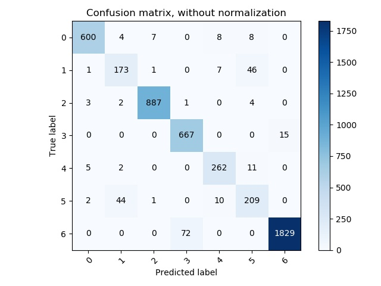

## Classifier: Convolutional Neural Network
- Algorithm: Tensorflow / Keras CNN
- Features: Wort-Unigramme
- Reported by: Yindong Wang

### Performance
- Seconds used for training: 109
- Seconds used for classification: 0.2

### Classification report
                            precision    recall  f1-score   support

             Wilhelm Busch       0.97      0.96      0.97       627
Johann Wolfgang von Goethe       0.73      0.74      0.74       228
              Henrik Ibsen       1.00      0.99      0.99       897
               James Joyce       0.91      0.96      0.93       682
               Franz Kafka       0.91      0.93      0.92       280
        Friedrich Schiller       0.78      0.77      0.77       266
            Virginia Woolf       0.98      0.97      0.98      1901

                 micro avg       0.95      0.95      0.95      4881
                 macro avg       0.90      0.90      0.90      4881
              weighted avg       0.95      0.95      0.95      4881

### Confusion matrix
[[ 604    3    1    1    8   10    0]
 [   5  155    1    0    3   64    0]
 [   3    0  887    2    3    2    0]
 [   0    0    0  666    0    0   16]
 [  14    5    0    0  253    8    0]
 [   6   45    0    0    7  208    0]
 [   0    0    0   55    0    0 1846]]

### Confusion matrix (img)

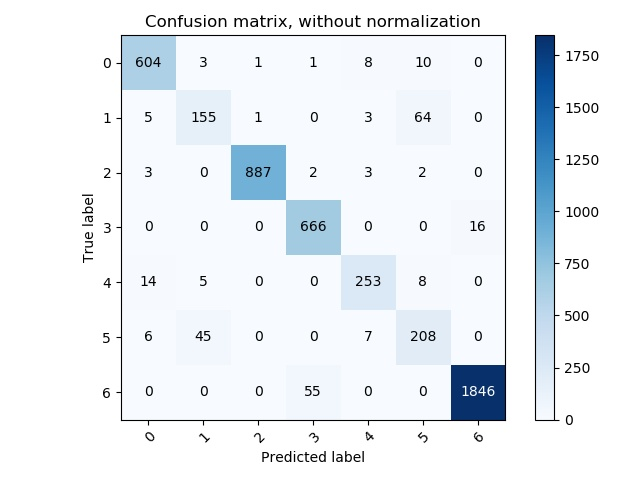

## Classifier: K-Nearest-Neighbors with Truncated SVD on Single Words
- Algorithm: Scikit-learn KNeighbors with truncated SVD (1000 dimensions)
- Features: single words (tf-idf-weighted)
- Reported by: Jakob Jungmaier

### Performance

- Seconds used for training: 130
- Seconds used for classification: 1240

### Classification report
                                  precision    recall  f1-score   support

                     Franz Kafka       0.54      0.75      0.63       280
              Friedrich Schiller       0.52      0.62      0.56       266
                    Henrik Ibsen       1.00      0.97      0.98       897
                     James Joyce       0.78      0.81      0.80       682
      Johann Wolfgang von Goethe       0.54      0.47      0.50       228
                  Virginia Woolf       0.93      0.92      0.93      1901
                   Wilhelm Busch       0.89      0.73      0.80       627

                        accuracy                           0.84      4881
                       macro avg       0.74      0.75      0.74      4881
                    weighted avg       0.85      0.84      0.85      4881

### Confusion matrix
      [[ 211   36    0    1   10    0   22]
       [  45  164    0    0   45    0   12]
       [   5    8  873    5    5    0    1]
       [   0    0    0  551    0  131    0]
       [  34   68    0    0  107    0   19]
       [   0    0    0  146    0 1755    0]
       [  94   41    4    0   33    0  455]]
 
### Confusion matrix (img)

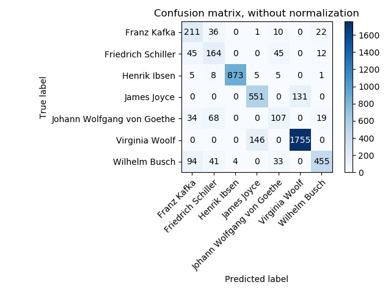

## Classifier: Perceptron with Truncated SVD on Single Words
- Algorithm: Scikit-learn Perceptron with truncated SVD (1000 dimensions)
- Features: single words (tf-idf-weighted)
- Reported by: Jakob Jungmaier

### Performance
- Seconds used for training: 172
- Seconds used for classification: 866

### Classification report
                                  precision    recall  f1-score   support

                     Franz Kafka       0.89      0.85      0.87       280
              Friedrich Schiller       0.79      0.63      0.70       266
                    Henrik Ibsen       1.00      0.98      0.99       897
                     James Joyce       0.92      0.91      0.91       682
      Johann Wolfgang von Goethe       0.56      0.83      0.67       228
                  Virginia Woolf       0.97      0.98      0.97      1901
                   Wilhelm Busch       0.96      0.89      0.92       627

                        accuracy                           0.92      4881
                       macro avg       0.87      0.87      0.86      4881
                    weighted avg       0.93      0.92      0.93      4881

### Confusion matrix
      [[ 237    7    0    2   19    0   15]
       [   4  168    0    0   93    0    1]
       [   3    3  883    5    2    0    1]
       [   0    0    0  620    0   62    0]
       [   3   28    0    0  189    0    8]
       [   0    0    0   46    0 1855    0]
       [  18    6    4    2   35    1  561]]
       
### Confusion matrix (img)

# Classification results for author classification
This page contains the classification results for the various algorithms, letter author classification

## Classifier: Random Forest without bootstrapping
- Algorithm: Scikit-learn random forest
- Features: 100 trees, balanced class weight, minimum split at 5 samples, no bootstrapping
- Reported by: Sabine Ullrich

### Performance

- Seconds used for training: 203
- Seconds used for classification: 29

### Classification report
                            precision    recall  f1-score   support

               Franz Kafka       0.83      0.70      0.76       280
        Friedrich Schiller       0.73      0.74      0.73       266
              Henrik Ibsen       1.00      0.97      0.98       897
               James Joyce       0.96      0.67      0.79       682
Johann Wolfgang von Goethe       0.71      0.46      0.56       228
            Virginia Woolf       0.89      0.99      0.94      1901
             Wilhelm Busch       0.78      0.95      0.85       627

                  accuracy                           0.88      4881
                 macro avg       0.84      0.78      0.80      4881
              weighted avg       0.89      0.88      0.88      4881

### Confusion matrix
	[[ 197    7    0    0    2    0   74]
	 [   7  198    0    0   33    0   28]
	 [   5    5  869    5    4    0    9]
	 [   0    0    0  456    0  226    0]
	 [   8   55    0    0  105    0   60]
	 [   0    0    0   14    0 1887    0]
	 [  19    8    1    0    4    0  595]]
			 
### Confusion Matrix (img)

## Classifier:  Random Forest with bootstrapping
- Algorithm: Scikit-learn random forest
- Features: 100 trees, no weights, no minimum split, bootstrapping
- Reported by: Sabine Ullrich

### Performance: 

- Seconds used for training: 142
- Seconds used for classification: 29

### Classification report

                            precision    recall  f1-score   support

               Franz Kafka       0.80      0.46      0.58       280
        Friedrich Schiller       0.67      0.61      0.63       266
              Henrik Ibsen       1.00      0.97      0.98       897
               James Joyce       0.97      0.54      0.69       682
Johann Wolfgang von Goethe       0.68      0.29      0.41       228
            Virginia Woolf       0.86      1.00      0.92      1901
             Wilhelm Busch       0.67      0.98      0.80       627

                  accuracy                           0.84      4881
                 macro avg       0.81      0.69      0.72      4881
              weighted avg       0.85      0.84      0.83      4881

 
### Confusion matrix: 

	[[ 128    9    0    0    2    0  141]
	 [  17  161    0    0   25    0   63]
	 [   2    3  870    5    2    0   15]
	 [   0    0    0  366    0  316    0]
	 [   9   66    0    0   67    0   86]
	 [   0    0    0    5    0 1896    0]
	 [   4    3    1    0    2    0  617]]
		 
	 
### Confusion Matrix (img)

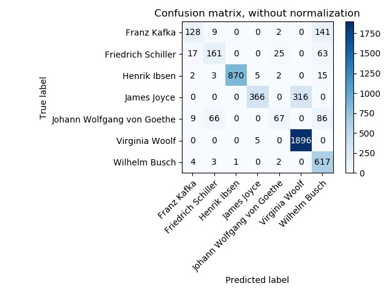

#Info:
Classifier: Gradient boosting (m3-l02)
Label: author

#Counts:
Number of training records: 39077
Number of classified records: 4881
Number of unique classes in records: 7
Number of unique classes found: 7

#Performance:
Seconds used for training: 404
Seconds used for classification: 21

#Classification report:
                            precision    recall  f1-score   support

               Franz Kafka       0.83      0.75      0.79       280
        Friedrich Schiller       0.70      0.76      0.73       266
              Henrik Ibsen       1.00      0.98      0.99       897
               James Joyce       0.92      0.80      0.85       682
Johann Wolfgang von Goethe       0.69      0.57      0.63       228
            Virginia Woolf       0.93      0.98      0.95      1901
             Wilhelm Busch       0.85      0.93      0.88       627

                  accuracy                           0.90      4881
                 macro avg       0.85      0.82      0.83      4881
              weighted avg       0.90      0.90      0.90      4881

#Confusion matrix:
[[ 211    9    0    0    6    0   54]
 [  11  201    0    0   37    0   17]
 [   5    2  880    3    3    0    4]
 [   0    0    0  543    0  139    0]
 [   9   61    0    0  131    0   27]
 [   0    0    0   44    0 1854    3]
 [  17   13    1    1   14    0  581]]

### Confusion Matrix (img)

# Classification results for author classification

## Classifier: Decision Trees
- Algorithm: Scikit-learn DecisionTreeClassifier
- Features: criterion='gini',splitter='best'
- Reported by: Alexander Vordermaier

### Performance

- Seconds used for training: 487
- Seconds used for classification: 5

### Classification report
                                  precision    recall  f1-score   support

                     Franz Kafka       0.55      0.54      0.54       280
              Friedrich Schiller       0.45      0.47      0.46       266
                    Henrik Ibsen       0.97      0.97      0.97       897
                     James Joyce       0.69      0.72      0.70       682
      Johann Wolfgang von Goethe       0.41      0.38      0.40       228
                  Virginia Woolf       0.90      0.88      0.89      1901
                   Wilhelm Busch       0.76      0.77      0.76       627

                        accuracy                           0.80      4881
                       macro avg       0.67      0.68      0.68      4881
                    weighted avg       0.80      0.80      0.80      4881

### Confusion matrix
      [[ 150   35    6    0   25    0   64]
	   [  33  126    4    0   64    0   39]
       [   1    7  873    3    3    1    9]
       [   0    0    2  494    0  186    0]
	   [  23   75    1    0   87    0   42]
	   [   0    0    5  221    0 1674    1]
	   [  68   38    5    2   33    0  481]]
			 
### Confusion Matrix (img)

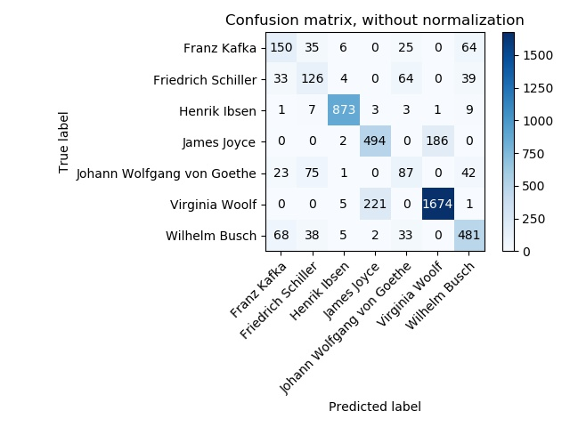

# Classification results for Language classification

## Classifier: Decision Trees
- Algorithm: Scikit-learn DecisionTreeClassifier
- Features: criterion='gini',splitter='best'
- Reported by: Alexander Vordermaier

### Performance

- Seconds used for training: 390
- Seconds used for classification: 11

### Classification report
                                  precision    recall  f1-score   support

                              da       0.99      0.99      0.99       838
							  de       1.00      1.00      1.00      1443
							  en       1.00      1.00      1.00      2517
							  fr       0.97      0.92      0.94        36
							  it       0.79      0.87      0.83        31
						 unknown       0.50      0.31      0.38        16

                        accuracy                           0.99      4881
				       macro avg       0.87      0.85      0.86      4881
					weighted avg       0.99      0.99      0.99      4881

### Confusion matrix
      [[ 832    1    1    0    0    4]
	   [   4 1436    2    0    0    1]
	   [   2    0 2511    0    4    0]
	   [   0    0    2   33    1    0]
	   [   0    0    3    1   27    0]
	   [   4    3    2    0    2    5]]
			 
### Confusion Matrix (img)

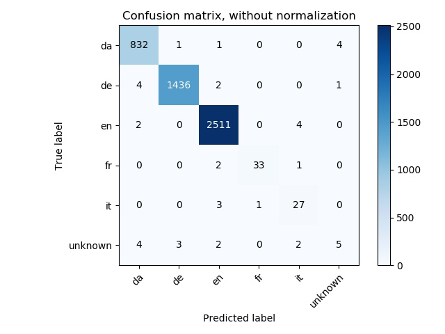

